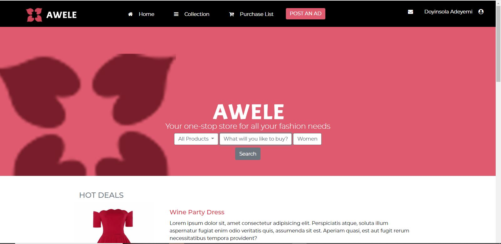

# Awele Fashion Store

# Capstone Project
Awele E-commerce Website

This project is a model of an e-commerce fashion store. It is based on the prototype made by [Mohammed Awad on Behance](https://www.behance.net/M_Awad)

This project is my HTML & CSS Capstone Project in Microverse.

The goal of the project is to apply all the basic HTML & CSS functions to wrap up all the knowledge acquired along the HTML & CSS section of Microverse Learning Program.

The project has two pages. The first is the home page that has the various categories that the website has.

The second is the page that displays the result of the information searched for on the homepage. Once the "search" link has been pressed, it leads to the search page.




**An e-commerce website built for Awele Fashion Store**

## Built With

- HTML
- CSS3
- Bootstrap

[Live Demo Link to Home Page](https://rawcdn.githack.com/Abidoyinsola1/awele-fashion-store/f07c9a288750f5290194661ad59d2785086caf91/index.html)

[Live Demo Link to Result Page](https://raw.githack.com/Abidoyinsola1/awele-fashion-store/feature-branch/result.html)


## Getting Started

To get a local copy of the repository please run the following commands on your terminal:

```
$ cd <folder>
```

```
$ git clone git@github.com:Abidoyinsola1/awele-fashion-store.git
```

```
$ cd to move into the downloaded folder
```

```
drag and drop the index file into the browser
```


## Author

👤 **Adeyemi Abiola Doyinsola**

- Github: [@Abidoyinsola1](https://github.com/Abidoyinsola1)
- Twitter: [@Abidoyinsola](https://twitter.com/abidoyinsola)
- LinkedIn: [Doyinsola Abiola Adeyemi](https://www.linkedin.com/in/doyinsola-adeyemi)

## 🤝 Contributing

Contributions, issues and feature requests are welcome!

## Show your support

Give a ⭐️ if you like this project!